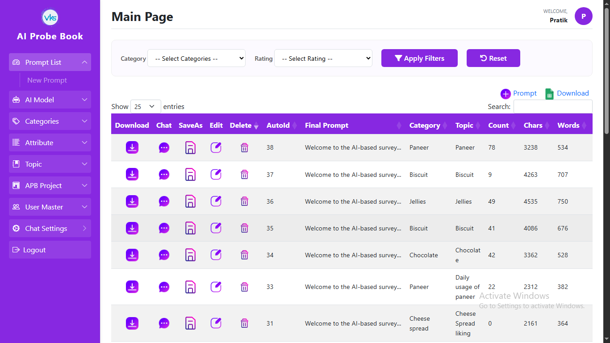
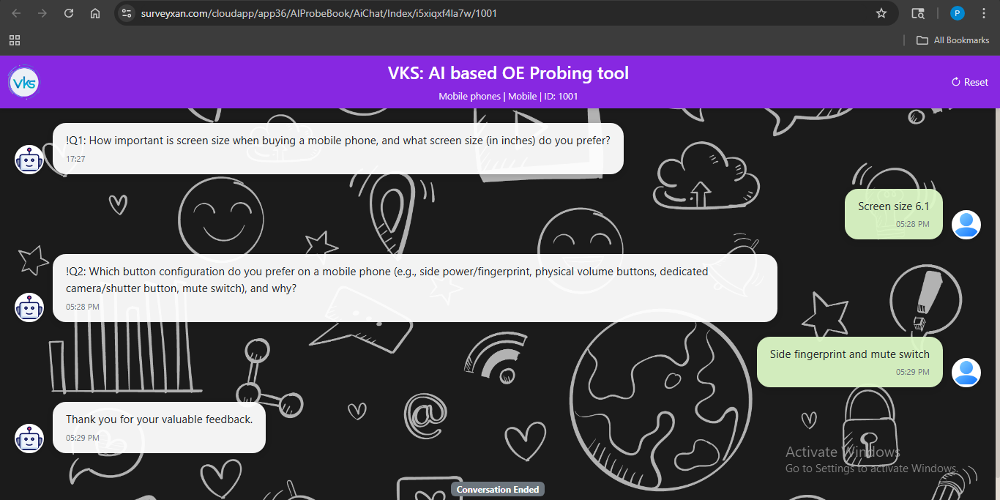

# 🤖 AI Probe Book

AI Probe Book is a management platform for creating, monitoring, and controlling AI-driven survey conversations for product market research. It supports switching between multiple AI providers (OpenAI, Gemini), dynamic prompt generation, and fully customizable respondent chat interfaces.

**Live demo:** [surveyxan.com/cloudapp/app36/AIProbeBook](https://surveyxan.com/cloudapp/app36/AIProbeBook/Login/SignIn)

---

## 🛠️ Tech Stack

- **Backend:** ASP.NET Core MVC, C#, ADO.NET
- **Database:** Microsoft SQL Server
- **API:** REST APIs, Swagger for documentation
- **Other:** Excel export (ClosedXML), multilingual support, role-based configuration

---

## 🚀 Key Features

- **Multi-AI Provider Support** — switch between OpenAI, Gemini, or custom AI models without code changes
- **Smart Prompt Engine (AutoGen)** — automatically builds structured prompts from product categories, topics, and positive/negative attributes
- **Custom Chat Branding** — configurable colors, titles, logos, and background images per client
- **Survey Rule Engine** — set min/max question limits, language rules, and topic restrictions
- **Link Generation & Export** — generate unique respondent chat links and export them to Excel
- **Multilingual Support** — run surveys across multiple languages
- **Validation & Data Integrity Checks** — catch incomplete or invalid responses before they reach reporting

---

## 📸 Screenshots

### Main Dashboard
Manage AI models, categories, attributes, and automated prompt configurations:



### Live Chat Interface
The customized chat window used by respondents during survey sessions:



---

## ⚙️ Getting Started

1. Clone the repository
```bash
   git clone https://github.com/pratikindalkar/AIProbeBook.git
```
2. Open the solution in Visual Studio
3. Update the connection string in `appsettings.json` to point to your SQL Server instance
4. Run database migrations / execute the provided SQL scripts
5. Build and run the project

Full setup and deployment instructions are available in [`/docs`](./docs).

---

## 📂 Project Structure

- `AILogBook V1.5/` — core survey and prompt management module
- `ChatAPI V1.0/` — REST API layer handling chat sessions and AI provider integration
- `docs/` — documentation and deployment guides

---

## 📄 Documentation

Detailed documentation and deployment steps are available in the [`/docs`](./docs) folder.
